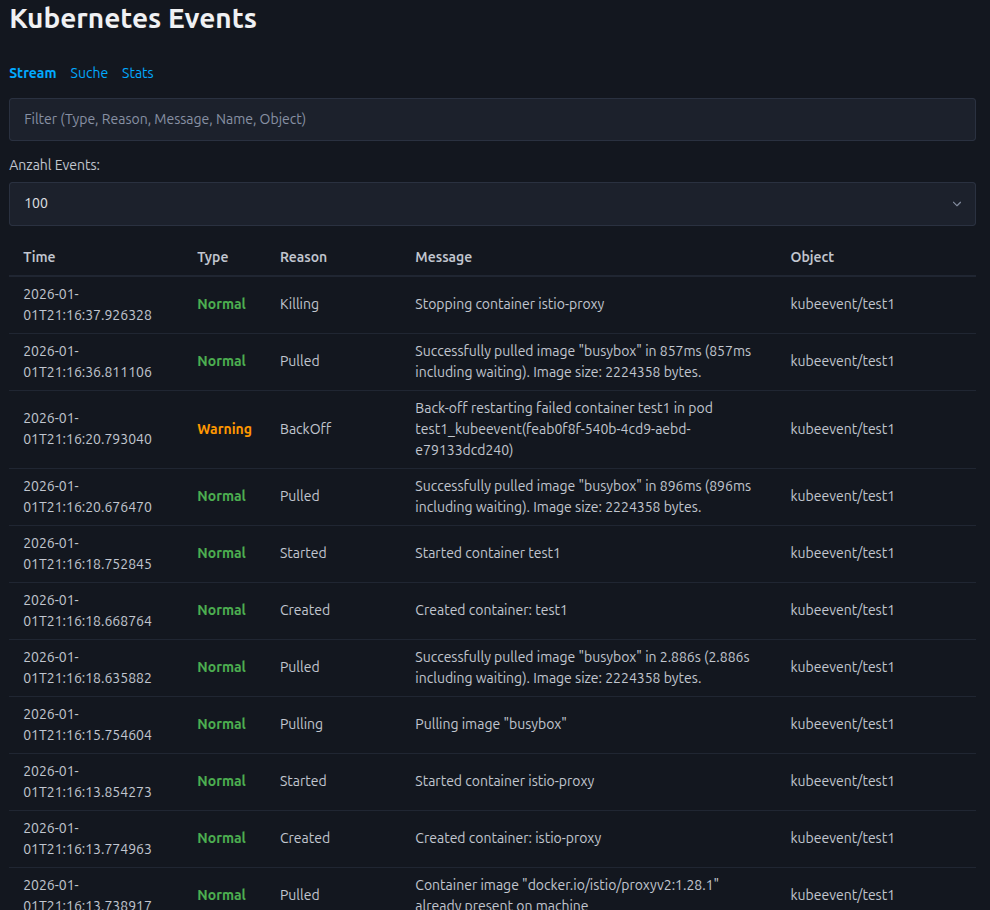
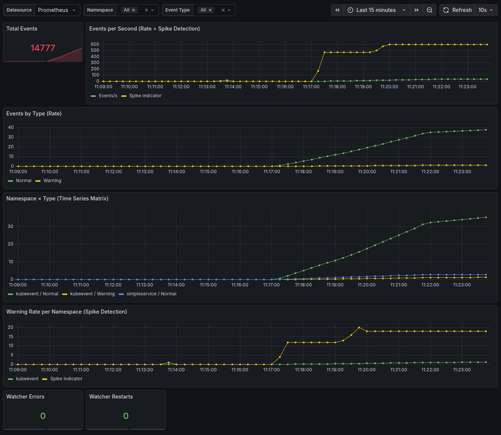
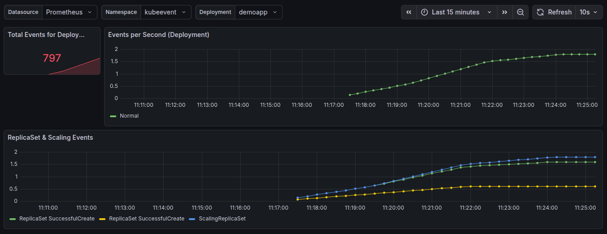
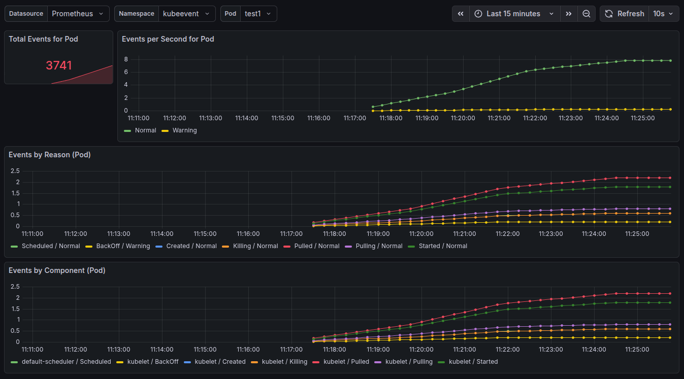

# 📡Kubernetes Event Dashboard
A lightweight, real‑time dashboard for collecting, storing, searching, and visualizing Kubernetes Events.
This project provides:
- A FastAPI backend that watches Kubernetes events, stores them in a database, and exposes REST + SSE endpoints
- A minimal frontend for live event streaming, searching, filtering, and pagination
- Prometheus metrics for monitoring event activity
- A clean, self‑contained solution for debugging clusters and understanding workload behavior



## Features
### Real‑time Event Stream
- Uses Kubernetes’ watch API
- Streams events via Server‑Sent Events (SSE)
- Live updates without page reloads
- Client‑side filtering (type, reason, message, namespace, involved object)

### Prometheus Metrics
Exposes /metrics with:
- Total events received
- Events by type (Normal, Warning, Error)
- Events by namespace
- Watcher errors

### Persistent Storage
- Stores all events in a SQLModel/SQLite (or any SQLModel‑compatible DB)
- Prevents event loss
- Allows historical search

## Architecture Overview
```
+-------------------+        +---------------------+
| Kubernetes API     | ----> | FastAPI Watcher     |
| (Events)           |       | (k8s_watcher.py)    |
+-------------------+        +---------------------+
                                    |
                                    v
                           +------------------+
                           | SQLModel Storage |
                           +------------------+
                                    |
                                    v
+-------------------+        +---------------------+
| Frontend (HTML/JS)| <----> | FastAPI REST + SSE  |
| Live Stream + UI  |        | /events/stream      |
+-------------------+        | /events/search      |
                             | /metrics            |
                             +---------------------+
```

## start from scratch
- uv sync
- uv pip compile pyproject.toml -o requirements.txt
- uv run uvicorn main:app --host 0.0.0.0 --port 8001 --reload

## access ui and metrics
- http://localhost:8001
- http://localhost:8001/metrics


## run commands for local debugging in cluster
```bash
cd kubeevent-chart
helm install kubeevent . -n kubeevent --create-namespace

cd ..
curl -fsSL https://raw.githubusercontent.com/metalbear-co/mirrord/main/scripts/install.sh | bash

POD=$(kubectl get pod -n kubeevent -l app=kubeevent -o jsonpath='{.items[0].metadata.name}')

mirrord exec -t pod/$POD -n kubeevent  -- uv run uvicorn main:app --host 0.0.0.0 --port 8001 --reload
```

## create events
```bash
kubectl run test1 -n kubeevent --image=busybox -- echo hi
kubectl delete pod test1 -n kubeevent

kubectl create deployment demoapp -n kubeevent --image=nginx
kubectl scale deployment demoapp -n kubeevent --replicas=2
kubectl scale deployment demoapp -n kubeevent --replicas=0
kubectl delete deployment demoapp -n kubeevent
```

## Grafana Dashboard screenshots




